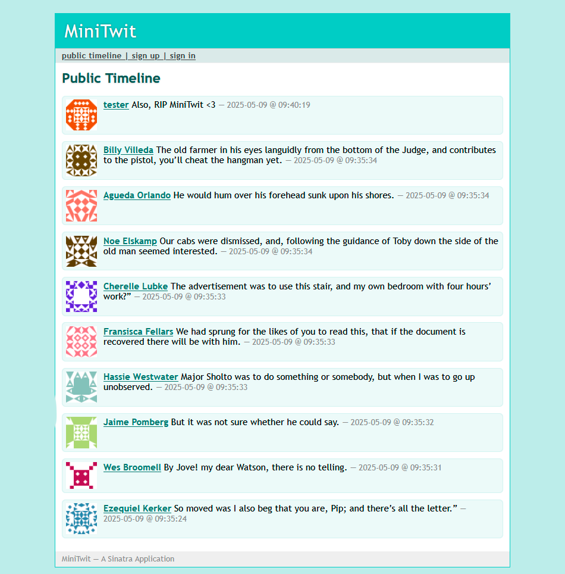

# Group B DevOps Report

Course code: BSDSESM1KU  
Date: May 29, 2025

Bryce Raj Karnikar \- [brka@itu.dk](mailto:brka@itu.dk)  
Gabriel Noah Fabricius \- [gafa@itu.dk](mailto:gafa@itu.dk)  
Mathias Niklas Larsen \- [mnla@itu.dk](mailto:mnla@itu.dk)  
Nikolaj Ho Alsøe \- [nals@itu.dk](mailto:nals@itu.dk)  
Stine Helena Sørensen \- [sths@itu.dk](mailto:sths@itu.dk)

# **Systems perspective** 

## Design and architecture 

Deployment architecture for our Minitwit application. Lines indicate dependencies. 

The system consists of two droplets, a master and a worker, which are duplicates of each other. KeepAlived ensures high availability of the two droplets by using heartbeats. 

Heartbeats are sent between the two nodes, and if the master is unresponsive, the worker elects itself as the new master and changes the reserved IP to point towards itself, thus directing traffic to the new master. 

This means that users will now access the worker server that is a duplicate, and since the database is hosted remotely, the data is consistent.

The DB runs on a separate droplet, which ensures consistent data between the two nodes.

## Dependencies and technologies 

**Development:**

* RubyGems \- Package manager for Ruby  
* standardrb \- Ensures Ruby code adheres to style and formatting standards.  
* Rubycritic \- Analyzes code quality and provides maintainability metrics.  
* SonarQube \- Code quality inspection  
* Rake \- Tasking running in Ruby

**Web Framework:**

* Sinatra \- Lightweight web framework   
* Puma \- HTTP server for Ruby apps  
* Nginx \- Proxy and TLS certification

**Security:**

* Skipfish \- Vulnerability scanner for web apps  
* ZAP \- Vulnerability scanner   
* dawnscanner \- Performs static application security testing (SAST) for Ruby applications.  
* FeroxBuster \- Scanner for exposed resources  
* Bcrypt \- Password hashing

**Infrastructure:**

* Digital Ocean \- Cloud provider  
* KeepAlived \- High availability  
* Docker \- Containerization

**Monitoring & Logging:**

* Prometheus \- Monitoring/metrics collection  
* Grafana \- Monitoring data visualization  
* Filebeats \- Log collection and shipping  
* ElasticSearch \- Log collection  
* Kibana \- Log data visualization  
* cAdvisor \- Container resource monitoring

**CI/CD:**

* Github Actions   
* Docker compose \- Service orchestration

**Database:** 

* SQLite \- Development database  
* PostgreSQL \- Production database

**Misc:**

* Shell scripts  
* SSH

## Important interactions of subsystems 

The underlying system interactions are nearly identical between a user request and an api request. The only major difference is whether the HTML handlers or the API handlers will be handling the request, and some correlated differences in logging. Only the data access layer is instrumented, and metrics are therefore updated identically whether handling a user or an api request. 

### User request

![][image2]  
Sequence diagram of a user request

### API request 

![][image3]  
Sequence diagram of an API request

## Current system status 

Analyzing the project using the static analysis tool SonarQube, we get the following:  
![][image4]  
The project's main branch is in good health, as it passes the Sonar way quality gate, and scores a rating of “A” in security, reliability, and maintainability.

Rubycritic is also applied via the workflow with a current score of 78,58%. We have mainly focused on SonarQube instead of Rubycritic when taking actions for maintaining quality.

# **Process' perspective**

## CI/CD

### Continuous integration 

Triggered by:

* Pull Requests: Runs on pull requests targeting the main branch.  
* Push Events: Runs on pushes to the main branch.  
* Manual Trigger: Can be triggered manually via workflow\_dispatch.

The workflow runs two jobs concurrently:  
1\. Linting, formatting, and static analysis tools

* Tools:  
  * standardrb  
  * dawnscanner  
  * rubycritic  
* Steps:  
  * Installs standardrb, dawnscanner, and rubycritic as user-installed gems.  
  * Run standardrb for linting.  
  * Clone the DawnScanner knowledge base repository and run DawnScanner.  
  * Run rubycritic to generate code quality reports.

2\. Testing

* Tools:  
  * run\_tests.sh: A custom script that runs unit tests, UI tests, and API tests  
  * Docker Compose  
* Steps:  
  * Build Docker images for the application and PostgreSQL db using Dockerfile.test and Dockerfile.postgresql.  
  * Use docker-compose.test.yml to spin up test containers and run tests.  
  * The run\_tests.sh script executes:  
    * RSpec: For Ruby unit and UI tests.  
    * Pytest: For API tests.  
    * The script ensures all tests pass before proceeding.

### Continuous deployment 

Triggered by:

* Push Events: Runs on pushes/releases with tags matching the pattern ‘v\*’ (e.g., v1.0, v20.15.10).  
* Manual Trigger: Can be triggered manually via workflow\_dispatch.

Runs a single job called \`build\` that can be split into 3 stages:  
1\. Build and Push Docker Image

* Tools:  
  * docker/build-push-action: Builds and pushes the application Docker image to DockerHub.  
* Steps:  
  * Build the application image using Dockerfile.app.  
  * Push the image to the Docker registry with caching enabled for faster builds.

2\. Deployment Preparation

* Tools:  
  * SSH: Used for secure communication with remote servers.  
  * rsync: Syncs files to remote servers.  
* Steps:  
  * Configure SSH by creating a private key file (\~/.ssh/do\_ssh\_key) with appropriate permissions.  
  * Sync Grafana dashboards and docker-compose.yml to both the hot and standby servers.

3\. Deployment

* Tools:  
  * SSH: Executes deployment scripts on remote servers.  
  * deploy.sh: A custom script that handles the deployment process.  
* Steps:  
  * Run the deploy.sh script on the hot server to:  
    * Stop the current application (docker compose down).  
    * Pull the latest Docker images (docker compose pull).  
    * Start the updated application (docker compose up \-d).  
  * Repeats the same deployment process on the standby server.

## Monitoring

We instrument our code using the Prometheus client for Ruby, which allows us to expose instrumentation metric primitives through an HTTP interface. These metrics are then scraped and collected by a Prometheus server. The data is then funnelled into Grafana for visualization.  
Fig: Our Grafana dashboard  
We monitor:

* The rate of HTTP requests by endpoint, their duration, and packets received for usability metrics  
* Memory and CPU usage (provided by cAdvisor) for system health  
* Active user count for business metrics

Monitoring response duration allows us to find any endpoint that is failing, which might also indicate suboptimal database read/write performance, or see if the system is slowing down overall. Splitting it up by endpoint also lets it act as a business metric, showing behavior patterns in users. For instance, we found that a surprisingly high percentage of interactions were “`follow”` requests.

Since “users” in the simulator did not have realistic login/out behavior, measuring active users could not be done by counting logged-in users. Instead, the total number of unique users who had sent a request in the last 15 seconds was measured.

## Logging 

Our logging stack is the EFK stack: ElasticSearch, FileBeat, and Kibana. Each of our server droplets (master and worker) has their own instance of an EFK stack.

### Log aggregation 

The stack aggregates logs in the following manner:

* First, any containers running on the droplet generate logs by themselves, and we specifically generate our custom logs with our Minitwit service.  
* Second, FileBeat monitors all the containers on the droplet and forwards all their logs to ElasticSearch.  
* Third, ElasticSearch stores and indexes all incoming logs from FileBeat.  
* Finally, Kibana accesses the logs in ElasticSearch and visualises them on a dashboard.

### Custom logs

While all of our containers generate various logs by themselves, we’re also printing custom logs directly to STDOUT, which is then picked up by FileBeat.

We have debug, info, and warn logs that we print.

* Debug is mostly internal logs from functions being called, so we can track down where a crash or similar occurred.  
* Info is what we use when a request has finished processing, and we print out all its details.  
* We use warn whenever the program internally tries to find a user that doesn’t exist, or when someone fails to log in, since it could be malicious.

## Security 

We discovered a vulnerability after having run nmap, that our database port was exposed despite setting up a UFW to block all IPs trying to access the port except our app’s IP. This was due to Docker inserting its own rules directly into the ip-tables, thus bypassing the UFW rules.

We tried fixing Docker incompatibility with UFW by disabling Docker’s ip-table management, which was mentioned at a lecture, but this didn't work.   
We could instead have used a fix proposed in UFW-Docker: ([https://github.com/chaifeng/ufw-docker](https://github.com/chaifeng/ufw-docker)). 

When running Skipfish, an XSS vulnerability was discovered in the input fields of the /login and /register pages of our application. We fixed it by using HTML sanitization (\`h()\`), which prevents special characters from being interpreted as HTML tags. We also ran FeroxBuster, a tool for displaying exposed resources. It found nothing of risk.

![][image5]

**Security matrix**  
The security matrix was based on reports from Skipfish and ZAP.

![][image6]

† Likelihood times Impact, see appendix (1)

 \* Absence of anti-CSRF token: This means that malicious users can inject scripts into the website using the HTML forms. Sinatra doesn't have an inbuilt protection against CSRF. Instead, the Rack gem can provide anti-forgery tokens to prevent this.

\*\* Absence of CSP header: We haven’t set up the CSP header to protect against Cross-Site Scripting, Clickjacking, Data Injection, and Form Hijacking. A CSP header can easily be added to prevent these attacks.

\*\*\* Cookie without secure flag and SameSite attribute: Risk of having Man-in-the-middle attack, credentials leaks, and session hijacking. Can be solved by adding a Secure header to cookies, the SameSite attribute mitigates CSRF.

## Scalability

Vertical scaling has been applied when considering upgrades, as KeepAlived was the chosen implementation for zero percent downtime. This meant scaling the droplet based on Digital Ocean's monitoring, such that we could examine which resource was bottlenecked.   
We took into account whether we had slowed down compared to the other teams by examining if our “latest” was keeping up with others on the simulation website.

The current master and worker droplets have therefore been through 3 iterations:

## AI usage

We have utilized a couple of AI tools during our project work. These tools were mostly used when we encountered challenges where we needed more guidance and did not know where to look, or after trying other possibilities.

It supported us with:

* Quicker problem solving, not having to exhaust ourselves on where to find what was relevant  
* Concept explanations, if there was confusion on a subject  
* Suggestions for solutions that we might not have thought about

It hindered us with:

* Inaccuracy or misdirection, if the prompts were not good enough  
* Context limitation, if we did not have enough information

# **Reflection Perspective** 

## Evolution and Refactoring 

A prominent challenge during development that took a lot longer than expected was migrating our database from a SQLite database to a PostgreSQL database.  
The issue we ran into here was that we had used a protected keyword in PostgreSQL in our SQLite database.

We ended up solving our database migration problem by first manually duplicating the existing database from the running droplet. We then created a new table and manually copied the data into the new table, such that we didn’t use the protected keyword ‘user’. Then we migrated from SQLite to PostgreSQL using PGLoader. After that, we hosted the database in a droplet for itself, and changed our code to interact with the new PostgreSQL integration [commit  8b4092c](https://github.com/Five-Crowns/Minitwit_Crown/commit/8b4092cc479f3f547513731b17e922ab143de429).

Another big hindrance in our project was that DigitalOcean limited our droplet count to 3 droplets. This limit was never resolved. We contacted Digital Ocean on multiple occasions, each time they denied our request to increase the droplet amount, due to a lack of billing history.

We adapted to this by having a droplet running our database, and then having 2 droplets running KeepAlived with a script that changes the reserved IP to point towards the current master.

Lessons learned

* There is always a solution, even though it may be unconventional.  
* Not to start with an SQLite database, in case you want to migrate later on.

## Operation

During this project, we learned that the mindset we should keep is that automation is the way forward. We structured our operations around having minimal manual intervention. Therefore, we relied on GitHub workflows, static analysers, and containerization. This ensured we could deploy without friction, which meant that we could deliver a proper increment on every release.

An issue we had in the beginning was that we relied on manual intervention to set up the prerequisites for the automation. This involved manually inserting the environment files into the droplet, such that it wasn't built into the Docker container, since we could only have one privately hosted on Docker Hub. This slowed down our deployments in the beginning, but after getting more comfortable with Docker and shell scripts, we ended up integrating the secrets better and more automatically.

## Maintenance 

During the project, we set up logging so we could monitor for errors and gather statistics on activities. We got logging up and running quite late in the project, which meant we were relying on looking for them manually and on monitoring with the visualisation from Grafana, which was not an ideal situation.

When we got logging up, we had a few issues. One was data synchronisation with ElasticSearch. Since each droplet has its own instance of the whole EFK stack, ElasticSearch is *also* duplicated, and we don’t have data synchronization between the two instances. This, of course, means that incoming requests to our service only generate logs on the active droplet, leading to log data being split between the two.

In hindsight, it would have been a smarter decision to have ElasticSearch and Kibana on their own droplet, and then have FileBeat on all other droplets to collect the logs and ship them to ElasticSearch. This is one thing we would change if we were to keep working on the project.

Another obstacle was the Kibana authorization. Normally, one would generate a certificate for Kibana to use when accessing ElasticSearch. We instead used simple password authentication because it was easier to set up. Doing it this way means that Kibana’s access account for ElasticSearch disappears along with Kibana’s volume. This isn’t optimal, and means that we have to manually set up the ‘Kibana\_System’ account every time we have a fresh volume. It isn’t often, but we’ve had to set up the account on each droplet, so it’s already been done twice. This is not an ideal situation, but if given more time, we would have set it up with a generated certificate.

## Devops style 

This project differed from previous project work due to the focus on DevOps.  
We had previously worked on a project where we gained some experience with workflows and publishing to the cloud, as part of the Chirp project from our BDSA course.

During this project, we expanded our DevOps approach by adopting Infrastructure-as-Code practices. We utilized Vagrant for provisioning virtualized environments on Digital Ocean, Docker for containerization and consistent deployment, and established a CI/CD pipeline with GitHub Actions to automate testing, building, and deploying our application consistently across various environments.

This streamlined implementation process significantly boosted productivity, enabling us to focus on new features with confidence. Automated testing and deployment via our CI/CD pipeline ensured reliable integration of changes, providing faster, more dependable feedback.

While setting up some of these tools was time-consuming and occasionally frustrating, the long-term benefits were undeniable.

## 

## Appendix

1. Risk matrix for security vulnerabilities:
